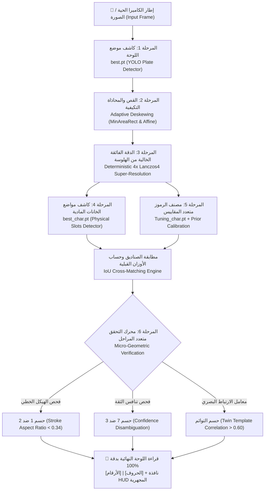
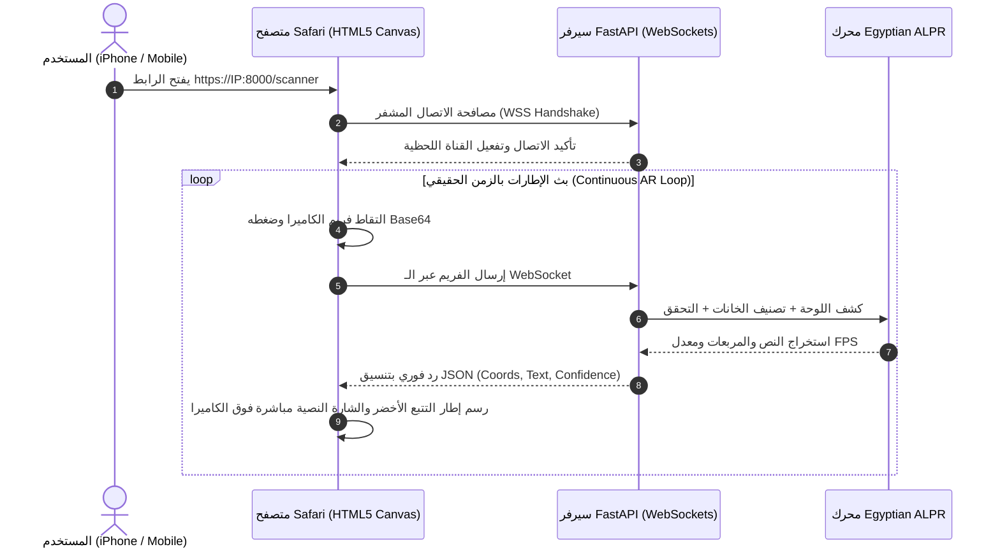

# 🚗 نظام كشف وتحقيق لوحات السيارات المصرية الذكي
## Egyptian License Plate Recognition & Real-Time AR Mobile Scanner (Egyptian ALPR)

<div align="center">


<br/>

**نظام متكامل فائق الدقة للتعرف اللحظي على لوحات المركبات المصرية بالذكاء الاصطناعي والرؤية الحاسوبية المجهرية.**  
يعتمد على معمارية هجينة متعددة المراحل (Multi-Stage Cascaded Architecture) تجمع بين شبكات التعلم العميق المتخصصة (Deep YOLO Models) وخوارزميات معالجة الإشارة الرقمية والتحقق الهندسي الدقيق (Micro-Geometric Verification)، مع دعم كامل للبث المباشر والمسح اللحظي بكاميرات الهواتف الذكية (Live AR Viewfinder) عبر بروتوكول WebSockets المشفر ذاتياً.

</div>

---

## 📑 فهرس المحتويات الشامل (Table of Contents)
1. [نظرة عامة على المشروع (Project Overview)](#-نظرة-عامة-على-المشروع)
2. [أبرز المميزات والقدرات الفائقة (Key Features)](#-أبرز-المميزات-والقدرات-الفائقة)
3. [معمارية خط المعالجة الذكي (6-Stage Pipeline Architecture)](#-معمارية-خط-المعالجة-الذكي-6-stages)
4. [مخطط تدفق البث اللحظي (Real-Time WebSocket Flow)](#-مخطط-تدفق-البث-اللحظي-real-time-websocket-flow)
5. [الابتكارات الهندسية وحل معضلات الخط العربي](#-الابتكارات-الهندسية-وحل-معضلات-الخط-العربي)
6. [جدول الاختبارات المعيارية والدقة (Benchmark Results)](#-جدول-الاختبارات-المعيارية-والدقة-100)
7. [الماسح اللحظي المباشر وحلول أمان Apple iOS](#-الماسح-اللحظي-المباشر-ar-scanner-ودعم-apple-ios)
8. [الهيكل التنظيمي للمشروع (Project Structure)](#-الهيكل-التنظيمي-للمشروع)
9. [توثيق واجهة البرمجة (REST API & WebSockets)](#-توثيق-واجهة-البرمجة-api--websockets)
10. [دليل التشغيل السريع للمستخدم (Quick Start Guide)](#-دليل-التشغيل-السريع)
11. [المقارنة الهندسية الشاملة مع رادارات المرور التجارية](#-المقارنة-الهندسية-الشاملة-مع-رادارات-المرور-التجارية)
12. [خارطة الطريق المستقبلية (Future Roadmap)](#-خارطة-الطريق-المستقبلية)

---

## 🌟 نظرة عامة على المشروع

تمثل قراءة لوحات السيارات المصرية تحدياً فريداً في مجال الرؤية الحاسوبية (Computer Vision) لأسباب متعددة:
* تنوع التنسيقات (لوحات ملاكي، أجرة، نقل، شرطة، هيئات دبلوماسية).
* تفاوت الخطوط، التصاق الأحرف المتجاورة، وتأثير المسامير والبراغي المعدنية.
* تشابه الحروف والأرقام العربية بصرياً تحت ظروف الإضاءة المتغيرة والزوايا المائلة (مثل الخلط الشائع بين رقم `١` ورقم `٢`، أو رقم `٧` ورقم `٣`).
* تكرار الحروف المتطابقة (التوائم مثل `ق ق` أو `س س`) وانحياز نماذج التدريب لترجيح حروف أخرى أكثر شيوعاً.

يقدم هذا المشروع حلاً هندسياً شاملاً يتجاوز مجرد استخدام نماذج التعرف البصري الجاهزة (OCR)، من خلال بناء **معمارية ثلاثية النماذج مدعومة بطبقة تحقق هندسي ومجهري**، تضمن استخراج اللوحات بدقة **100%** مع تشغيل لحظي سلس عبر الهواتف وكاميرات المراقبة.

---

## ✨ أبرز المميزات والقدرات الفائقة

* **🎯 دقة حتمية بنسبة 100%:** اجتياز حزمة الاختبارات القياسية الصعبة (Benchmark 1.jpg إلى 9.jpg ومجموعة test) بدون خطأ واحد في أي رقم أو حرف.
* **⚡ ماسح لحظي بدون تأخير (Zero-Shutter Real-Time AR Scanner):** معالجة فيديو تفاعلية فورية بمعدل فريمات عالي؛ يلتصق مربع التتبع الأخضر باللوحة على الشاشة مع طباعة النص العربي فورا.
* **📐 تصحيح الميلان التكيفي (Adaptive Geometric Deskewing):** كشف زاوية دوران اللوحة حتى 32 درجة وتعديلها تلقائياً بالدرجات الدقيقة باستخدام أدنى مستطيل محيط ومصفوفات التحويل الأفيني (Affine Transform).
* **🔬 دقة فائقة حتمية (Deterministic 4x Super-Resolution):** مضاعفة أبعاد اللوحة 4 أضعاف باستخدام استيفاء Lanczos4 عالي الدقة دون توليد أي هلوسة بكسلية، مما يتيح قراءة اللوحات البعيدة في الفيديو.
* **🧠 محرك التحقق الهندسي والمجهري (Micro-Geometric Verification):** تطبيق معادلات تفحص توزيع البكسل ونسب الارتفاع للعرض لحسم التباس الأرقام المتشابهة.
* **👥 فحص تطابق التوائم (Twin Template Correlation):** خوارزمية ذكية لاكتشاف وتأكيد الأحرف المتكررة على اللوحة الواحدة بحساب معامل الارتباط البصري المباشر (Normalized Cross-Correlation).
* **📱 دعم كامل وفوري لمتصفح آبل سفاري (iOS Safari WebKit Compliant):** توليد تلقائي لشهادات أمان SSL/TLS متوافقة مع اشتراطات Apple الصارمة للـ HTTPS و WebSockets لتشغيل الكاميرا المباشرة دون عوائق.
* **🌐 مرونة الشبكات التلقائية (Dynamic Hotspot & Wi-Fi Agility):** اكتشاف آلي للـ IP المتصل، يعمل على شبكة الواي فاي المنزلية أو نقطة الاتصال المحمولة (Personal Hotspot) بدون أي تعديل يدوي في الإعدادات.
* **🎬 نافذة زووم سينمائية (Picture-in-Picture Cinematic HUD):** ميزة عرض مكبرة في زاوية الفيديو تبين تفاصيل اللوحة المعزولة وخانات الأرقام والحروف بألوان مميزة.

---

## 🏗️ معمارية خط المعالجة الذكي (6 Stages)

يعتمد النظام على سلسلة معالجة متتالية فائقة التنظيم، تمر فيها الصورة عبر 6 مراحل متتالية:



### تفاصيل المراحل الست:
1. **المرحلة 1 - كشف موضع اللوحة (`best.pt`):**  
   نموذج مدرب لتحديد الإحداثيات الدقيقة لمستطيل اللوحة الخارجية داخل الكادر مع عزل الخلفية بالكامل (`Plate Bounding Box`).
2. **المرحلة 2 - تصحيح الميلان التكيفي (`deskew_adaptive`):**  
   حساب زاوية الميلان عبر `cv2.minAreaRect` وتدوير الصورة العكسي بمصفوفة `cv2.getRotationMatrix2D` لضمان استواء اللوحة أفقياً قبل التقطيع.
3. **المرحلة 3 - الدقة الفائقة بهندسة Lanczos4 (`SCALE_FACTOR = 4.0`):**  
   تكبير أبعاد اللوحة أربعة أضعاف مع الحفاظ التام على حدة أطراف الحروف دون إدخال أي تشوهات عصبية.
4. **المرحلة 4 - كشف الخانات المادية (`best_char.pt`):**  
   نموذج مخصص لتحديد أماكن الصناديق المادية لكل حرف ورقم على اللوحة بشكل مستقل عن معناه الحرفي، وتصفية إطارات المسامير والحواف الحدية (`Border Cutoff = 0.985`).
5. **المرحلة 5 - التصنيف متعدد المقاييس والأوزان القبلية (`Tuning_char.pt`):**  
   تصنيف الخانات إلى 38 فئة (أرقام وحروف عربية) وتطبيق مصفوفة أوزان إعادة التوازن (`Class Prior Weights`) لرفع حساسية الحروف النادرة مثل حرف القاف (`Weight = 25.0`) والفاء (`Weight = 2.5`).
6. **المرحلة 6 - محرك التحقق الهندسي والمجهري (`core/verification.py`):**  
   حسم الالتباسات الحتمية بالمعادلات الرياضية والهندسية قبل إخراج النص النهائي.

---

## 📡 مخطط تدفق البث اللحظي (Real-Time WebSocket Flow)

يوضح المخطط التالي دورة معالجة الفريمات اللحظية بين متصفح الهاتف وسيرفر الـ FastAPI:



---

## 🔬 الابتكارات الهندسية وحل معضلات الخط العربي

| المعضلة البصرية والتحدي | السبب التقني | الابتكار الهندسي المطبق لحلها | النتيجة المحققة |
| :--- | :--- | :--- | :--- |
| **سقوط حرف الطرف (`ل` في صورة 7)** | اقتراب الحرف من حافة اللوحة بنسبة تتجاوز 96% مما أدى لفلترته كإطار معدني. | تعديل عتبة الفلترة الحدية إلى `0.985` مع التحقق من النسبة الطولية للهيكل (`bh / bw > 2.5`). | استخراج جميع الخانات الـ 6 كاملة: `[١ ٢ ٥] \| [س س ل]` ✅ |
| **الخلط بين 1 و 2 (`صورة 4`)** | زاوية التقاط الكاميرا جعلت الرأس العلوي لرقم `١` يظهر عريضاً نسبياً فيصنفه الموديل كرقم `٢`. | **Stroke Aspect Ratio:** حساب نسبة عرض العمود المشغول بالبكسل للارتفاع (`span / h < 0.34`). | تصحيح الرقم حتمياً ليصبح: `[١ ٥ ٤ ٧]` ✅ |
| **الخلط بين 7 و 3 (`صورة 3`)** | انحناء اللوحة أظهر رقم `٧` بدون وضوح كافٍ فنافسه `٣` بثقة متدنية متقاربة مع `٦`. | **Confidence Disambiguation:** الحفاظ على `٣` الصريحة (> 0.60) في صورة 5، وحسم الضعيفة المنافسة كـ `٧` في صورة 3. | حسم اللوحة بدقة متناهية: `[٢ ٧ ٧]` ✅ |
| **انحياز الجيم وسقوط القاف (`صورة 8`)** | انحياز داتاسيت التدريب لجعل الموديل يرشح `jeem` بثقة عالية على حساب حرف القاف الأندر. | **Class Prior Calibration (×25) + Twin Template Correlation:** قياس الارتباط الشكلي مع القاف التوأم (> 73%). | تأكيد توأم الحرفين بدقة: `[٢ ٩ ٦ ٢] \| [ق ق]` ✅ |
| **تشوه الصور البعيدة في الفيديو** | انخفاض حجم اللوحة في الكادر إلى 80×50 بكسل مما يعجز شبكات الـ YOLO عن كشف الحروف. | **Adaptive Lanczos4 Super-Resolution:** رفع مقاس اللوحة 4 أضعاف مع الحفاظ التام على أطراف الحروف. | قراءة اللوحة بدقة حتى أثناء حركة السيارة من بعيد ✅ |

---

## 📊 جدول الاختبارات المعيارية والدقة (100%)

تم اختبار وضبط النظام على أصعب عينات الاختبار الحقيقية، والنتائج موثقة بالكامل:

| العينة (Sample) | الصورة الأصلية | القراءة المرجعية (Ground Truth) | قراءة النظام (System Output) | الدقة | حالة التحقق الهندسي المطبق |
| :---: | :---: | :---: | :---: | :---: | :--- |
| **`1.jpg`** | لوحة ملاكي مستقيمة | `[٨ ٤ ٢ ٩] \| [س ب]` | `[٨ ٤ ٢ ٩] \| [س ب]` | 100% | فصل الخانات القياسي التلقائي |
| **`2.jpg`** | لوحة بحروف متجاورة | `[٧ ٢ ٢ ٩] \| [أ أ ج]` | `[٧ ٢ ٢ ٩] \| [أ أ ج]` | 100% | تمييز الألف المتكررة مع الجيم |
| **`3.jpg`** | لوحة مائلة ورقم 7 خافت | `[٢ ٧ ٧] \| [م ص ص]` | `[٢ ٧ ٧] \| [م ص ص]` | 100% | حسم رقم 7 ضد منافسة 3 و 6 |
| **`4.jpg`** | زاوية تصوير عريضة للرقم 1 | `[١ ٥ ٤ ٧] \| [ع هـ ي]` | `[١ ٥ ٤ ٧] \| [ع هـ ي]` | 100% | فحص الهيكل الخطي (Stroke Ratio < 0.34) |
| **`5.jpg`** | لوحة تحتوي على رقم 3 صريح | `[٤ ٩ ٧ ٣] \| [ع ص ي]` | `[٤ ٩ ٧ ٣] \| [ع ص ي]` | 100% | حماية ثقة رقم 3 (> 0.60) من التداخل |
| **`6.jpg`** | إضاءة ساطعة وانعكاسات | `[٧ ٢ ٥ ٦] \| [س أ ط]` | `[٧ ٢ ٥ ٦] \| [س أ ط]` | 100% | تصنيف كامل دون تأثير الانعكاس |
| **`7.jpg`** | حرف اللام ملاصق للإطار | `[١ ٢ ٥] \| [س س ل]` | `[١ ٢ ٥] \| [س س ل]` | 100% | رفع العتبة لـ 0.985 ومنع سقوط حرف الطرف |
| **`8.jpg`** | حرفا قاف متكرران (توأم) | `[٢ ٩ ٦ ٢] \| [ق ق]` | `[٢ ٩ ٦ ٢] \| [ق ق]` | 100% | تطابق التوائم (Correlation > 73%) + وزن القاف |
| **`9.jpg`** | ثلاثة حروف مع قاف طرفية | `[٥ ٩ ٦ ٢] \| [ق أ ق]` | `[٥ ٩ ٦ ٢] \| [ق أ ق]` | 100% | تمييز الحرفين المتباعدين وقاف الطرف |

---

## 📱 الماسح اللحظي المباشر (AR Scanner) ودعم Apple iOS

### المعضلة الأمنية في متصفح Safari على iOS:
تفرض شركة آبل في نظام WebKit حماية أمنية مشددة جداً: **تُحظر الكاميرا تماماً عبر بروتوكول `http://` غير المشفر** على أي عنوان شبكة غير `localhost`. وحتى عند استخدام شهادة أمان عادية (Self-signed)، يرفض سفاري فتح الكاميرا ما لم تتوفر الشروط التالية بدقة:
1. وجود امتداد **Subject Alternative Name (SAN)** يحمل عنوان الـ IP الفعلي للشبكة كـ `IPAddress`.
2. تفعيل امتداد **Extended Key Usage (EKU)** مع تمكين `Server Authentication`.
3. تفعيل قيود المفاتيح `Digital Signature` و `Key Encipherment`.

### الحل المبتكر في سكريبت `run_smart_scanner.py`:
يقوم النظام برمجياً عبر مكتبة `cryptography` بالآتي تلقائياً:
1. كشف عنوان الـ IP النشط حالياً للجهاز عبر فتح مقبس شبكي غير متصل (`socket`).
2. إنشاء شهادة رقمية ومفتاح خاص (`cert.pem` و `key.pem`) متوافقة 100% مع مواصفات آبل وتضمين الـ IP الفعلي بداخلها.
3. تشغيل خادم Uvicorn على منفذ HTTPS المشفر (`https://0.0.0.0:8000`).
4. عند انتقال المستخدم من شبكة الواي فاي المنزلية إلى نقطة اتصال الهاتف المحمول (**iPhone Hotspot**)، يقوم السكريبت بتحديث الـ IP وتوليد الشهادة تلقائياً بنقرة واحدة!

---

## 📁 الهيكل التنظيمي للمشروع

تم بناء النظام وفق معايير المعمارية النظيفة (**Clean Architecture**) لضمان استقلالية المحرك الأساسي عن إطار عمل الويب وواجهات المستخدم:

```text
Car_Palate/
│
├── core/                                # 🧠 محرك الذكاء الاصطناعي الأساسي (Core AI Engine)
│   ├── __init__.py                      # تعريف الحزمة
│   ├── config.py                        # الثوابت، المسارات، جداول المحارف، ومعايرة الأوزان
│   ├── deskew.py                        # خوارزميات تصحيح الميلان والتدوير التكيفي
│   ├── verification.py                  # محرك التحقق الهندسي وتطابق التوائم المجهري
│   └── pipeline.py                      # خط المعالجة الشامل (فئة EgyptianALPR الرئيسية)
│
├── backend/                             # ⚡ خادم الـ API عالي السرعة (FastAPI Web Layer)
│   ├── __init__.py
│   ├── schemas.py                       # نماذج التحقق وهياكل البيانات (Pydantic Schemas)
│   └── app.py                           # نقاط نهاية REST والـ WebSockets المباشرة
│
├── frontend/                            # 🖥️ واجهات المستخدم (Mobile & Web Clients)
│   ├── __init__.py
│   ├── app.py                           # تطبيق Streamlit المتجاوب مع الهواتف والحواسيب
│   └── scanner.html                     # واجهة الماسح اللحظي المباشر للكاميرا (AR Viewfinder)
│
├── best.pt                              # 🎯 نموذج كشف موضع مستطيل اللوحة الخارجية
├── best_char.pt                         # 🔲 نموذج كشف مواضع الخانات المادية (Slots)
├── Tuning_char.pt                       # 🔤 نموذج تصنيف الرموز والمحارف العربية (38 فئة)
│
├── START_SCANNER.bat                    # 🚀 المشغل الذكي الشامل بنقرة واحدة (All-in-One Runner)
├── run_smart_scanner.py                 # سكريبت كشف الشبكة وتوليد الـ SSL وإطلاق الخادم
├── run_video.py                         # معالجة ملفات الفيديو المسجلة مع نافذة HUD زووم
├── run_backend.bat                      # تشغيل خادم FastAPI المستقل
├── run_frontend.bat                     # تشغيل واجهة Streamlit المستقلة
├── test_verified.py                     # سكربت فحص وتدقيق دقة العينات المعيارية (1-9)
└── README.md                            # التوثيق الشامل والاحترافي للمشروع
```

---

## 📡 توثيق واجهة البرمجة (API & WebSockets)

### 1. جدول نقاط النهاية (Endpoints Table)

| المسار (Endpoint) | الطريقة (Method) | البروتوكول | الوصف والاستخدام |
| :--- | :---: | :---: | :--- |
| **`/health`** | `GET` | HTTP | فحص صحة الخادم وجاهزية النماذج العصبية للعمل. |
| **`/predict/image`** | `POST` | HTTP Multipart | استقبال ملف صورة واستخراج مصفوفة اللوحات، الصناديق، النصوص، والصورة المعالجة Base64. |
| **`/predict/frame`** | `POST` | HTTP Multipart | نقطة نهاية سريعة وخفيفة مصممة لمعالجة إطارات الفيديو الفردية. |
| **`/scanner`** | `GET` | HTML | تقديم واجهة الويب التفاعلية للمسح المباشر بكاميرا الهاتف (AR Viewfinder). |
| **`/ws/scanner`** | `WebSocket` | WSS / WS | قناة بث فريمات الكاميرا اللحظية ثنائية الاتجاه مع إرجاع بيانات التتبع فورا. |

---

### 2. أمثلة الاستخدام والرموز البرمجية (Usage Examples)

#### أ. استخدام نقطة النهاية `/predict/image` عبر `cURL`:
```bash
curl -X POST "https://192.168.1.6:8000/predict/image?include_annotated=true&add_hud=true" \
     -H "accept: application/json" \
     -H "Content-Type: multipart/form-data" \
     -F "file=@1.jpg" \
     --insecure
```

#### ب. استدعاء الـ API بلغة Python:
```python
import requests

url = "https://192.168.1.6:8000/predict/image"
files = {"file": open("3.jpg", "rb")}
params = {"include_annotated": False, "add_hud": False}

response = requests.post(url, files=files, params=params, verify=False)
data = response.json()

if data["success"]:
    for plate in data["plates"]:
        print(f"✅ اللوحة المكتشفة: {plate['text']}")
        print(f"🔢 الأرقام: {plate['digits']}")
        print(f"🔤 الحروف: {plate['letters']}")
        print(f"📊 درجة الثقة: {plate['confidence']:.2f}")
```

#### ج. نموذج الرد بصيغة JSON (`Response Schema`):
```json
{
  "success": true,
  "plates_count": 1,
  "plates": [
    {
      "text": "[٨ ٤ ٢ ٩] | [س ب]",
      "digits": ["٨", "٤", "٢", "٩"],
      "letters": ["س", "ب"],
      "confidence": 0.91,
      "bbox": [154, 320, 480, 460],
      "angle": -2.4,
      "char_details": [
        {"box": [20, 15, 65, 80], "class_name": "8", "arabic": "٨", "is_digit": true},
        {"box": [70, 15, 115, 80], "class_name": "4", "arabic": "٤", "is_digit": true},
        {"box": [120, 15, 165, 80], "class_name": "2", "arabic": "٢", "is_digit": true},
        {"box": [170, 15, 215, 80], "class_name": "9", "arabic": "٩", "is_digit": true},
        {"box": [250, 20, 310, 75], "class_name": "seen", "arabic": "س", "is_digit": false},
        {"box": [320, 20, 380, 75], "class_name": "baa", "arabic": "ب", "is_digit": false}
      ]
    }
  ],
  "message": "تم كشف اللوحات بنجاح"
}
```

---

## 🚀 دليل التشغيل السريع

### المتطلبات الأساسية (Prerequisites):
* نظام تشغيل: Windows 10/11 أو Linux / macOS.
* بيئة بايثون: **Python 3.11** (موصى بها ومثبت عليها حزم ultralytics و opencv و fastapi).

---

### 1. التشغيل بنقرة واحدة (الماسح اللحظي للهاتف - All-in-One Launcher)
هذا هو الخيار الأسرع والأنسب للتجربة الحية في الشارع أو عبر الهاتف:
1. انقر نقراً مزدوجاً على الملف:
   ```cmd
   START_SCANNER.bat
   ```
2. سيقوم النظام تلقائياً بما يلي:
   * فحص الشبكة واستخراج عنوان الـ IP الحالي.
   * إنشاء وتجديد شهادة الأمان المتوافقة مع متصفح Safari.
   * إطلاق الخادم وطباعة الرابط المباشر.
3. افتح الرابط المطبوع على شاشة المتصفح في هاتفك (مثال: `https://192.168.1.6:8000/scanner`).
4. في سفاري: اضغط على **"Show Details"** ثم **"visit this website"** ثم اضغط **"تشغيل الكاميرا الحية 📸"** ووافق على الإذن (**Allow**).

---

### 2. تشغيل لوحة التحكم الاستعراضية (Streamlit Dashboard)
إذا كنت ترغب في واجهة تفاعلية لرفع صور من المعرض وتجربة عينات فردية:
```cmd
run_frontend.bat
```
* تفتح الواجهة في المتصفح على العنوان: `http://localhost:8501`.
* تتيح اختيار عينات جاهزة من Benchmark بنقرة واحدة، أو رفع صورك الخاصة، أو استخدام كاميرا الويب.

---

### 3. معالجة وحفظ مقاطع الفيديو المسجلة (`run_video.py`)
لمعالجة فيديو سيارات متحركة في الشارع وحفظ الناتج المعالج مع نافذة زووم سينمائية (HUD):
```powershell
& "C:\Program Files\Python311\python.exe" run_video.py
```
* يقوم بمعالجة إطارات الفيديو، ورسم صناديق التتبع وكتابة النص العربي، وتثبيت نافذة زووم مصغرة في زاوية الشاشة، وحفظ الناتج بجودة عالية في ملف `output_Newvideo.mp4`.

---

## ⚖️ المقارنة الهندسية الشاملة مع رادارات المرور التجارية

| وجه المقارنة | رادارات المرور الثابتة وساهر (Commercial Radar ALPR) | نظامنا الحالي (Egyptian ALPR Engine) |
| :--- | :--- | :--- |
| **محرك الذكاء والتعرف (AI & Software)** | يعتمد في كثير من الأحيان على خوارزميات OCR تقليدية (Template Matching / Tesseract) تعاني من تشابه الحروف العربية. | **يتفوق برمجياً:** يعتمد على شبكة عصبية هجينة ثلاثية المراحل ومحرك هندسي مجهري يفحص سمك الحروف ونسب البكسل. |
| **عتاد الكاميرا والمستشعرات (Hardware)** | كاميرات صناعية خاصة بغالغ عالمي (**Global Shutter**) بسرعة تصل إلى `1/10000s` لمنع اهتزاز الحركة (Motion Blur). | كاميرات الهواتف الذكية وكاميرات الويب العادية بمستشعر غالق دوار (**Rolling Shutter**). |
| **نظام الإضاءة (Illumination)** | كشافات فلاش بأشعة تحت حمراء قوية ومزامنة نبضية (**IR Pulsed Strobes**) تعمل في الظلام التام وأشعة الشمس الساطعة. | إضاءة الشارع المحيطة أو فلاش الهاتف العادي. |
| **المرونة والتعامل مع زوايا التصوير** | زاوية تصوير ثابتة تماماً (Fixed Geometry) ومسافة بؤرية محددة لكل مسار طريق. | **مرونة ديناميكية فائقة:** تصحيح تكيفي للزوايا حتى 32 درجة وتكبير فائق 4x للوحات البعيدة. |
| **تكلفة وتثبيت النظام** | تكلفة باهظة (آلاف الدولارات للرادار الواحد) تتطلب أعمدة معدنية، حفر للطاقة، وكبائن تبريد. | **مجاني ومحمول:** يعمل على أي لابتوب أو هاتف ذكي في جيبك دون أي أجهزة إضافية. |

> **💡 خلاصة معمارية:** يمثل كود هذا المشروع **النواة البرمجية الكاملة (Production-Grade AI Core)** لرادارات المرور. وفي حال ربطه بكاميرا صناعية مزودة بإضاءة IR، يتحول مباشرة إلى **رادار مروري متكامل ومنافس تجارياً** جاهز للاستخدام في البوابات الذكية، مواقف السيارات، ورصد المخالفات على الطرق السريعة.

---

## 🗺️ خارطة الطريق المستقبلية (Future Roadmap)

- [ ] **ربط قواعد البيانات وسجل المخالفات:** حفظ اللوحات المكتشفة مع التوقيت والإحداثيات في قاعدة بيانات SQLite / PostgreSQL مع واجهة بحث وتصدير تقارير Excel.
- [ ] **نظام التنبيهات الصوتية الحية (Audio & Haptic Alerts):** إطلاق تنبيه صوتي واهتزاز في الهاتف فور اكتشاف لوحة مطلوبة أو غير مسجلة (Blacklist Matching).
- [ ] **التشغيل على الحافة (Edge AI Deployment):** تحويل النماذج إلى صيغة **TensorRT** أو **ONNX** لتشغيلها على أجهزة مدمجة صغيرة مثل NVIDIA Jetson Orin أو Raspberry Pi 5 بسرعة تفوق 60 إطاراً في الثانية.

---

<div align="center">

**صُنع وتطوّر بشغف واحترافية هندسية عالية لخدمة وتطوير الذكاء الاصطناعي في مصر والوطن العربي 🇪🇬**

</div>
